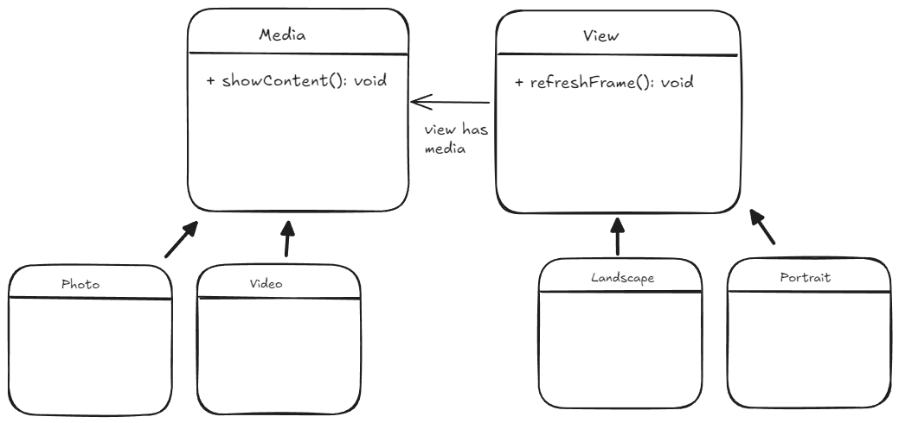
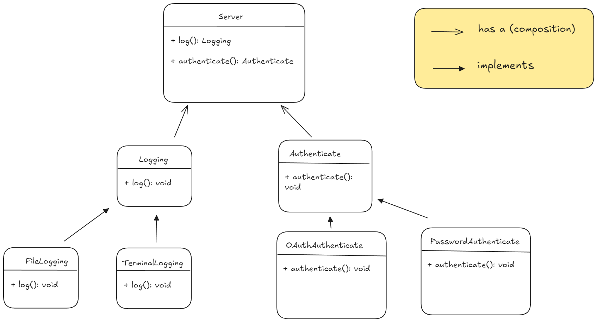

# Design Patterns

design patterns are way to approach to commonly occuring problems. 
They are not the exact solution but they give the idea and line of though for
certain problems on how you should approach them.

They are divided into three categories:
* Creational
* Structural
* Behavioural


## Creational Design Patterns
Ways on how to create objects when there is some complex structure or requirements.


### Factory Method

Factory for creating different objects of same category.

Using factory has below advantages-
* Deciding which class object is to be created at runtime based on certain conditions(parameterized factory method)

For example, we have a abstract `notificationFactory` and corresponding
Alert and Promotional notification factories whose `createNotification()` function
decides which notification to create(email and message) and with what
parameters.

* Abstracting complex object construction logic
* Follows open-closed principle. As the object we are creating through factory is
generic type it could later be replaced by just using different object's factory

For example, a notification factory and its sub-classes are EmailFactory and MessageFactory
concrete products are Message and Email. Both implement class Notification.(because both email And
message factory return notification type in code no problem if we replace later by a new type which
is also a notification)

* Factory is helpful in general when we want to dynamically create
multiple objects of same type. 

For example, we could pass the factory as a function parameter
and we can generate as many objects inside.


Below image shows parameterized factory method


### Abstract Factory

Helps to create famalies of similar objects.

So, for example, in a computer, 
we have different elements like - button, files, menu, etc
Also we have different os like windows, apple. Each have their own style
of showing these elements. So, we can have factory for each OS.

Advantages of using abstract factory-

* Consistency in object creation of same family

* Only changing the factory(from windows to apple), everything gets
changed, with no other change required.


### Builder Pattern

To construct an object in multistep fashion and providing the properties
of object to be constructed one by one in any order.
Finally, the object is constructed using all the order that were given before
in a systematic manner.

Example, a burger builder, you have various toppings like cheese, corn,
capsicum, etc. which one to add you decide and finally, the pizza is created 
based on the requirements in a systematic manner.


Example,

```python

class Pizza:

    def __init__(self, cheese, capsicum, onion, corn):
        self.cheese = cheese
        ...


class PizzaBuilder:

    def add_cheese(self, flavour="Morzilla"):
        self.cheese = Cheese(flavour)

    def add_capsicum(self, type="bell pepper"):
        self.capsicum = Capsicum(type)
    
    ...

    def create_pizza(self):
        return Pizza(self.cheese, self.capsicum....)


if __name__ == "__main__":
    pizza_builder = PizzaBuilder()

    pizza_builder.add_capsicum("red")
    pizza_builder.add_cheese()
    pizza_builder.add_corn()

    # finally create the pizza
    pizza_builder.create_pizza()
```

### Singleton Pattern

It restricts a class to have only one instance. No matter how many times we create an object, the same instance is returned.

This is useful when we want to have single object to be used application wide. For example - a database connection, a logger.

This is also used when we want to get global access to an object.

This is a shared resource so in case of concurrent access, we need to design it accordingly.

#### Method
1. Make the constructor private
2. Have a public static function for object creation calls the constructor first time and saves object in a static field, further calls return the same object.

```cpp

#include <iostream>
#include <mutex>

class DatabaseConnection {
private:
    static DatabaseConnection* instance; // Single instance
    static std::once_flag initFlag;      // Ensures single initialization
    std::string connectionString;

    // Private constructor to prevent external instantiation
    DatabaseConnection() {
        std::cout << "DatabaseConnection created.\n";
        connectionString = "DefaultConnectionString";
    }

public:
    // Delete copy constructor and assignment operator to avoid duplication
    DatabaseConnection(const DatabaseConnection&) = delete;
    DatabaseConnection& operator=(const DatabaseConnection&) = delete;

    // Destructor
    ~DatabaseConnection() {
        std::cout << "DatabaseConnection destroyed.\n";
    }

    // Static method to provide access to the single instance
    static DatabaseConnection* getInstance() {
        std::call_once(initFlag, []() {
            instance = new DatabaseConnection();
        });
        return instance;
    }

    // Example methods to simulate database operations
    void connect() {
        std::cout << "Connected to database with connection string: " 
                  << connectionString << "\n";
    }

    void disconnect() {
        std::cout << "Disconnected from database.\n";
    }

    void setConnectionString(const std::string& connStr) {
        connectionString = connStr;
    }

    std::string getConnectionString() const {
        return connectionString;
    }
};

// Initialize static members
DatabaseConnection* DatabaseConnection::instance = nullptr;
std::once_flag DatabaseConnection::initFlag;

// Main function to demonstrate the Singleton
int main() {
    // Access the Singleton instance and perform operations
    DatabaseConnection* db1 = DatabaseConnection::getInstance();
    db1->setConnectionString("Server=127.0.0.1;Database=MyDB;User=admin;Password=1234;");
    db1->connect();

    // Get the same instance elsewhere
    DatabaseConnection* db2 = DatabaseConnection::getInstance();
    std::cout << "Connection string in db2: " << db2->getConnectionString() << "\n";

    db2->disconnect();

    return 0;
}


// PS: AI generated
```

Code in python-
```python
import threading

class DatabaseConnection:

    # static variables
    _instance = None
    _lock = threading.Lock()

    def __new__(cls, *args, **kwargs):
        if not cls._instance:
            with self._lock:
                if not cls._instance:
                    cls._instance = super().__new__(cls)    # super helps in properly calling correct class method by following MRO(method resolution order)
                    cls._instance.initialize()
        return cls._instance

    def initialize(self):
        self.connection_string = "default_connection_string"

    def connect(self):
        # connection logic

    def disconnect(self):
        # disconnection logic

    def set_connection_string(self, connection_string):
        self.connection_string = connection_string


if __name__ == "__main__":
    db1 = DatabaseConnection()
    db1.set_connection_string("localhost:5432/my_db")

    db1.connect()
    # perform task
    db1.disconnect()

    db2 = DatabaseConnection()  # same object as db1

```

## Structural Design Patterns

Methods to create different structures using existing object/classes

### Adapter Pattern

Making two incompatible interfaces compatible by using an adpater.

**idea**

Interface 1 and interface 2 have different function signatures to execute
same thing. Adapter implements interface 1 and within that function it makes
call to function of interface 2 in the format it requests.

Below is the class diagram for the same-


The adapter has adaptee as its class member i.e composition is used.

There is another method called class adapter where the adapter inherit the adaptee instead of using it as its member. Then it can simply call the inherited method

> In python, if you inherit from multiple classes, and they have common method, then `super.method_name()` will call method of first class listed in inheritance.
```python
class A():
    def drive():
        pass

class B():
    def drive():
        pass

class C(A, B):
    def drive():
        super.drive()   # will call A's drive as it is listed first in inheritance list

# If we want to call B's we can do B.drive()
```

**Usecases**
* We had a SQL service to store our e-commerce website data. Now we want to shift
to No-SQL database. We create an adapter that coverts existing commands to be executed
in our No-SQL database.
* We have to integrate multiple third party payment gateways like paypal, stripe.
And we already have a simple `PaymentProcesser`. We create adapters for each
payment gateway so exsitng codebase works normally, just we need to use the
adapter of the required payment gateway.
* Synchronous to muiti-threaded converter.
* Let's say a new implementation of a function came which has different signature. We can use an adapter which still takes old function's signature and internally calls the new function with required signature. In this way we don't have to change the existing code.


**Note**

Adapter and decorator both wrap an interface. However, they
are different in the sense that adapter makes call of one interface
to be compatible with similar call of another interface w/o changing
any functionality.

However, the decorator wraps and adds additional behaviour to the existing
functionality.

**Code**

In below code, we have a gear car, however our client wants automatic car
which takes speed and drive. So, we create an adapter that wraps over
the gear car, takes the speed as input and applies necessary gear to drive
at that speed.


```python
from abc import ABC, abstractmethod

class GearCar():

    def __init__(self) -> None:
        self.current_gear = 0   # neutral by default
    
    def drive(self, gear) -> None:
        self.current_gear = gear
        self.__acclerate(gear)

    def __acclerate(self, gear) -> None:
        pass


class AutoCar(ABC):

    @abstractmethod
    def drive(self, speed) -> None:
        pass


class AutoCarAdapter(AutoCar):

    def __init__(self) -> None:
        self._gear_car = GearCar()

    def drive(self, speed) -> None:
        if speed >= 0 and speed <= 10:
            self._gear_car.current_gear = 1     # here we are chaining to get the
                                                # current_gear(which is property of gear_car)
                                                # which is ideally not good as we are accessing other object's property
                                                # here. We can easily solve this by making a function in gear_car to set the gear
        elif speed <= 25:
            self._gear_car.current_gear = 2
        elif speed <= 30:
            self._gear_car.current_gear = 3
        elif speed <= 50:
            self._gear_car.current_gear = 4
        else:
            self._gear_car.current_gear = 5

        self._gear_car.drive(self._gear_car.current_gear)


# main code
auto_car_adapter = AutoCarAdapter()

SPEED = 40
auto_car_adapter.drive(40)  # take 40km/hr speed and call 4th gear of car internally
```

### Facade Pattern

When we have a system consisting of multiple classes each interacting with each other and we want a simple way to perform an operation. For example, a compiler that has a *parser*, *tokenizer*, *symbol table*, etc. and we want to compile a sentence.

The *tokenizer* would need *symbol table* before hand, in XYZ way, the *parser* would need some other thing. all of these would interact with each other in complex way.

**idea**

We will create a class that defines the method `compile` which would take care of initializing all the compiler components and calling them in whatever order in whatever way to give us the output.


**code**

```python

class SymbolTable:
    ...

class Tokenizer:
    def __init__(self, symbol_table: SymbolTable) -> None:
        pass

class Parser:
    def __init__(self, symbol_table, tokenizer) -> None:
        pass

# compiler facade - hides all the complexity, and provides required, limited functionality access
class Compiler:
    def __init__(self) -> None:
        symbol_table = SymbolTable(...)
        symbol_table.init()

        tokenizer = Tokenizer(symbol_table)
        ...

    def compile(statement: str) -> str:
        symbols = symbol_table.get_symbols()
        ...
        return result


```


### Proxy Pattern

Controlling access to an object through another object(proxy). This is done for reasons like - security, caching, lazy function call etc


There are three types of proxy-

* **Remote Proxy**: A proxy that interacts with a remote object. This is helpful when you want to control the identity/ip through which request is sent to server(say using user's token), or maybe in Nodejs, we can avoid returning promises by awaiting in our proxy and returning final result.

* **Virtual Proxy**: when an object is expensive to create(or expensive method) we can do things lazily. When we initialize the object/call the method, it will show us that it is created, on the back hand it will do things lazily(hence virtual).

* **Protection Proxy**: Authenticate/authorize before providing access to object.


It is different from decorator pattern in the sense that although it adds functionality, it is only to control access and not modify core behaviour


In above, the proxy has the `real subject` and both proxy and real subject implement the interface `Isubject` 


### Decorator Pattern

Adding additional functionality over existing object while keeping the interface same.

**idea**

The decorator is a wrapper with same interface as the object it is wrapping, which adds/modify functionality of the object


In above, we have two main coffee(decaf, expresso) and we have additional flavours like caramel, soy. 

Then the decorator is a type of beverage and also it has a beverage.(this introduces recursion, meaning we can wrap decorator over decorator like caramel over soy... and finally it ends up with a decafe/expresso)

> The decorator doesn't add constraint over the order in which wrapping will be done.

**Code logic**

```python
from abc import abstractmethod, ABC


class Beverage:

    @abstractmethod
    def get_desc():
        pass
    
    @abstractmethod
    def cost():
        pass

class Decaf(Beverage):

    def cost():
        ...
    
    def get_desc():
        ...

class AddOnDecorator(Beverage, ABC):

    def __init__(self, beverage: Beverage):
        self.beverage = beverage

    @abstractmethod
    def cost():
        pass

    @abstractmethod
    def get_desc():
        pass

class Caramel(AddOnDecorator):

    def cost():
        ...     # some decoration
        xyz = self.beverage.cost()
        ...
        return xyz

    def get_desc():
        # similar to cost function


##### main code

decafe = Decafe()
carameled_decafe = Caramel(decafe)

carameled_decafe.cost()

```

### Bridge Pattern

Say we have two different class of items A and B. Both A and B have
their subclasses. A type uses B type items(composition).
We need to have a system where any subclass of A can be used with any
subclass of B.

For example, we have a `View` class. it has two subclasses, `Landscape` and
`Portrait`. Also, we have `Media` class that needs to be displayed in the `View`.
`Media` has subclasses like `Photo`, `Video`, `Website`.

We can use bridge pattern to construct above classes to make them compitable and easy
to use.



**Example**

* Used in creating custom item view like custom item recyclerview, 
custom item cardview in android. Where recyclerview can
contain different views like tiles, buttons, text. The recyclerview
contains a list of `View` items. 


## Behavioural Design Patterns

These patterns helps in determining how the *objects communicate 
with each other* and delegate tasks to each other based on the 
*responsibilities*.


### Strategy Pattern

When we have multiple algorithms for a method of a class, and which one to use
for which sub-class depends on the sub-class.

The solution is to have a interface for each of the behaviour(method) and 
then have various concrete implementation of that interface. Then we can decide which
one to plug in which sub-class. 

So, we are basically using composition to inject the required behaviour for a method
using the concerete interface.

Note that we won't be able to solve this using inheritance because, inheritance is
like a tree. You pass down the behaviour to the sub-classes. So, two classes down in 
different sub-trees may share some behaviour but not be able to share other
behaviour(*maybe because of this behaviour their parents moved in different trees*).

**Example**

We have a general `Server` class, the server could be a `Database`, 
an `Application`, `Proxy`, etc.

Server has two main functions - logging and authentication, and both of
them have different strategies of doing it. Specifically-
* Database - 
    * log into terminal (`TerminalLogging`)
    * username and password authentication

* Application - 
    * log to a file
    * oAuth based authentication


So, what we do is use the strategy pattern to create different strategies
for logging and authentication. See the UML diagram below-



```python
from abc import ABC, abstractmethod


# abstract Logging class and its concrete classes
class Logging(ABC):

    @abstractmethod
    def log(self, *args):
        pass

class FileLogging(Logging):

    def log(self, *args):
        file = args[0]
        with open(file, 'a+') as f:
            f.write(...)

class TerminalLogging(Logging):

    def log(self, *args):
        print(...)

# abstract Authentication class and its concrete classes
class Authenticate(ABC):

    @abstractmethod
    def authenticate(self, *args):
        pass

class PasswordAuthenticate(Authenticate):

    def authenticate(self, *args):
        username, passwd = args[0], args[1]
        ...

class OauthAuthenticate(Authenticate):

    def authenticate(self, *args):
        token = args[0]
        ...

class Server:

    def __init__(self, logging_behaviour: Logging, \
            authentication_behaviour:Authentication):
        self.logging = logging_behaviour
        self.authentication = authentication_behaviour

    def log():
        self.logging.log()


if __name__ == "__main__":
    
    # creating database server
    terminal_logging = TerminalLogging()
    password_authentication = PasswordAuthenticate()
    database = Server(terminal_logging, password_authentication)
    
    database.log()  # logs in terminal
    database.authenticate("admin", "strongpassword")  # authenticates user

    # creating application server
    file_logging = FileLogging()
    oauth_authentication = OauthAuthenticate()
    application = Server(file_logging, oauth_authentication)
        
    application.log()  # logs to a file
    application.authenticate("oauth_token")  # authenticates using oAuth

```

### Observer Pattern
### Command Pattern
### State Pattern


## Misc Patterns

* We can pass a config object to another object's constructor. The object will
then use the configurations to decide what to do. For example, we could have
a class that database connection object. To that we could pass the loggingConfig
based on which logging of database would be done.

```
mainLoggingConfig = DatabaseConfig(indentation=2, logColor='red', logLevel=1)

DatabaseConnection(URI, loggingConfig=mainLoggingConfig)
    fun log(s):
        space = mainLoggingConfig.indentation
        color = mainLoggingConfig.color or color.BLUE
        ...
        ...

```

* We should avoid returning boolean from function as they would result in creating if/else statement elsewhere in our program.

* Python don't have function overloading, however we can define single function
and check the parameters we have got within it and decide what to do. Like below-

```python
# by checking type of parameter
def drive(data):
    if isinstance(data, list):
        ...
    if isinstance(data, str):
        ...

def drive(*args, **kwargs):

    if args[0]...   # decide based on positional args
    if kwargs[...]....  # decide based on keyword args


```